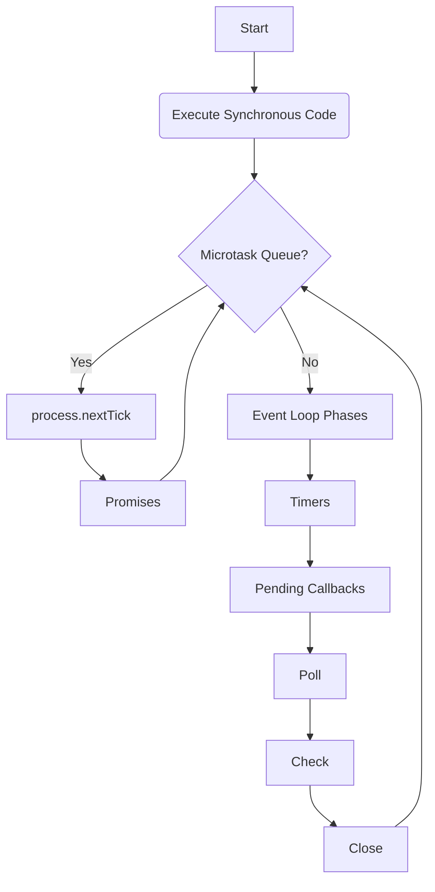

# 🚀 The Ultimate Node.js & Full-Stack Interview Guide

This document is your complete companion for securing a high-tier Backend Engineering role. It covers everything from core internals tosystem design and production operations.

---

## 🏗️ 1. Node.js Fundamentals & Architecture

### **What is Node.js?**
Node.js is a **cross-platform, open-source JavaScript runtime environment** that executes JavaScript code outside a web browser. 
*   **Engine:** It uses Google’s **V8 engine** (the same one used in Chrome).
*   **Model:** It follows an **event-driven, non-blocking I/O model**.
*   **Purpose:** Designed to build scalable network applications efficiently by handling many concurrent connections without the overhead of creating a new thread for every request.

### **Is Node.js single-threaded?**
**Yes and No.**
*   **The Main Thread:** JavaScript execution in Node.js is single-threaded (the Event Loop).
*   **The Background:** Node.js utilizes a **Thread Pool** (via the `libuv` library) for heavy tasks like File I/O, DNS lookups, and Cryptography. 
*   **Concurrency:** It handles thousands of concurrent requests by offloading I/O operations to the system kernel or the thread pool.

### **How does Node.js handle concurrency?**
Node.js uses the **Event Loop** and **libuv**. 
1.  A request arrives.
2.  The main thread starts the task.
3.  If the task is I/O intensive (e.g., DB call, file read), it is offloaded to the **system kernel** or **libuv's thread pool**.
4.  The main thread continues handling other requests (it doesn't wait).
5.  Once the background task completes, a callback is pushed to the **Callback Queue**.
6.  The Event Loop picks it up and executes the result.

---

## 🎡 2. The Event Loop & Execution Order

### **The Event Loop Phases**
The Event Loop is the "manager" that continuously checks for tasks. It moves through these phases in order:

1.  **Timers:** Executes `setTimeout()` and `setInterval()` callbacks.
2.  **Pending Callbacks:** Executes I/O callbacks deferred to the next loop iteration.
3.  **Poll:** Retrieves new I/O events; executes I/O related callbacks.
4.  **Check:** Executes `setImmediate()` callbacks.
5.  **Close Callbacks:** Executes close events (e.g., `socket.on('close', ...)`).

### **Microtasks vs. Macrotasks**
Execution priority is crucial:
*   **Microtasks:** `process.nextTick()` and **Promises** (`.then/catch/finally`).
*   **Macrotasks:** `setTimeout`, `setImmediate`, I/O operations.

> [!IMPORTANT]
> **Microtasks always run before Macrotasks.** Within microtasks, `process.nextTick()` has higher priority and runs before Promise callbacks.



---

## 🔒 3. Backend Security Best Practices (Crucial for Interviews)

### **How do you secure a Node.js API?**
1.  **Authentication & Authorization:** Use JWT (stateless) or Sessions (stateful). Implement **Role-Based Access Control (RBAC)**.
2.  **Data Sanitization:** Always validate input to prevent **SQL Injection** (Prisma does this by default) and **XSS** (Cross-Site Scripting).
3.  **Rate Limiting:** Use libraries like `@fastify/rate-limit` to prevent Brute Force and DDoS attacks.
4.  **Security Headers:** Use **Helmet.js** to set secure HTTP headers (e.g., `Content-Security-Policy`).
5.  **Environment Variables:** Never hardcode secrets. Use `.env` files and secret managers in production.
6.  **Dependency Scanning:** Regularly run `npm audit` to check for vulnerable packages.

### **What is the difference between Authentication and Authorization?**
*   **Authentication:** Verifying **who** the user is (Login).
*   **Authorization:** Verifying **what** the user is allowed to do (Permissions).

---

## 📡 4. API Design & Communication

### **REST vs GraphQL?**
*   **REST:** Resource-based. Uses standard HTTP methods. Good for caching and simple structures. Can suffer from over-fetching or under-fetching.
*   **GraphQL:** Query-based. One single endpoint. Clients ask for exactly what they need. Great for complex, nested data.

### **How do you handle API Versioning?**
*   **URI Versioning (Most Common):** `https://api.example.com/v1/users`
*   **Header Versioning:** Passing version info in custom headers.
*   **Accept Header:** `Accept: application/vnd.example.v1+json`

### **What is Idempotency in APIs?**
An operation is idempotent if it can be performed multiple times without changing the result beyond the initial application.
*   **Idempotent:** GET, PUT, DELETE.
*   **Not Idempotent:** POST (calling it twice creates two resources).

---

## ⚡ 5. Fastify: The High-Performance Framework

### **Why use Fastify over Express?**
*   **Performance:** Fastify is significantly faster due to its internal optimizations and use of `pino` for logging.
*   **Schema Validation:** Built-in JSON Schema validation (via Ajv) for request/response, which also improves performance by pre-compiling schemas.
*   **Plugin Architecture:** Encourages encapsulation and reusability through a consistent plugin system (`fastify-plugin`).

### **What are Fastify Hooks?**
Hooks allow you to listen to specific events in the lifecycle of a request (e.g., `onRequest`, `preHandler`, `onSend`).

---

## 💎 6. Prisma: Modern Type-Safe ORM

### **What is the difference between `prisma generate` and `prisma migrate`?**
*   **`prisma generate`:** Generates the TypeScript Prisma Client.
*   **`prisma migrate`:** Updates the database schema and tracks changes via migration files.

### **What is "n+1" problem and how does Prisma solve it?**
The N+1 problem occurs when fetching relations in a loop. Prisma solves this using **Batching** and **DataLoader** patterns internally to minimize queries.

---

## 🐘 7. PostgreSQL & Database Optimization

### **How do you optimize a slow database query?**
1.  **Explain Analyze:** Use `EXPLAIN ANALYZE` in Postgres to find bottlenecks.
2.  **Indexing:** Ensure correct indexes (B-Tree, GIN) are on filtered/joined columns.
3.  **Connection Pooling:** Use tools like **PgBouncer** or Prisma's built-in pooling to manage connections efficiently.
4.  **Avoid SELECT *:** Only fetch the columns you need.
5.  **Normalization vs Denormalization:** Normalize for data integrity; denormalize (caching) for read performance.

---

## 🧪 8. Testing & Quality Assurance

### **Testing Pyramid**
1.  **Unit Tests (Base):** Test individual functions/logic in isolation (Jest/Vitest).
2.  **Integration Tests:** Test how components work together (e.g., Service + Database).
3.  **E2E Tests (Top):** Test the entire user flow (Playwright/Supertest).

### **What is Mocking?**
Mocking is replacing a real dependency (like a database or an external API) with a fake implementation to isolate the code being tested.

---

## ⚙️ 9. DevOps & Production Operations

### **What is a "Graceful Shutdown"?**
When a server stops, it should finish processing current requests before closing. 
```javascript
process.on('SIGTERM', () => {
  server.close(() => {
    console.log('Server closed gracefully');
    process.exit(0);
  });
});
```

### **How do you monitor a Node.js application?**
*   **Logging:** Use structured logging (Pino/Winston).
*   **Metrics:** Monitor CPU, Memory, and Request latency (Prometheus/Grafana).
*   **Tracing:** Use APM tools (New Relic/Datadog) to trace requests through different services.

---

## 🚀 10. Performance & Debugging

### **How do you debug a Memory Leak in Node.js?**
1.  **Heap Snapshots:** Take snapshots using Chrome DevTools or the `v8` module and compare them to see which objects are not being garbage collected.
2.  **Profiling:** Use the `--inspect` flag to profile CPU usage.
3.  **Flame Graphs:** Use tools like 0x to visualize where the CPU is spending the most time.

### **What is the difference between `setImmediate` and `process.nextTick`?**
*   `process.nextTick`: Executes immediately after the current operation, **before** the event loop continues.
*   `setImmediate`: Executes in the next **Check phase** of the event loop.

---

## 💼 11. Behavioral Scenario: "The App is Slow"

**Interviewer:** "Our production API is suddenly responding slowly. How do you investigate?"
**Answer:**
1.  **Check Infrastructure:** Check CPU/Memory metrics (Is the server overloaded?).
2.  **Check Database:** Look for slow queries or high connection counts.
3.  **Check Logs:** Look for spikes in error rates or long processing times in middleware.
4.  **Identify Bottlenecks:** Use APM tools to see if a specific external API or a heavy computation is the culprit.
5.  **Short-term fix:** Horizontal scaling (add more instances) or clearing/refreshing cache.
6.  **Long-term fix:** Optimize the code or query identified in step 4.

---
*Good luck with your Backend Developer journey! 🚀*
